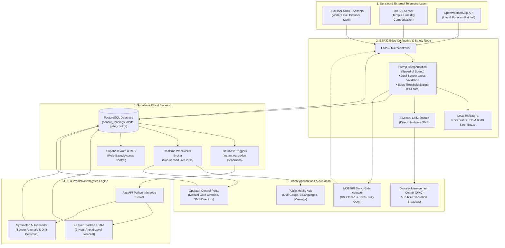

# SDAS — Smart Dam Alert System with Automated Gate Control

<p align="center">
  
</p>

<p align="center">
  <strong>"Safe Today, Secure Tomorrow"</strong><br/>
  <em>An End-to-End IoT & AI-Driven Flood Management System for the Puttalam District, Sri Lanka</em>
</p>

> **Single Dam Simulation Environment:** Implemented a configurable simulated dam profile based on the Tabbowa Dam environment to demonstrate water-level monitoring, AI prediction, automated gate control, and emergency alert workflows.

<p align="center">
  
  
  
  
  
</p>

---

## 🏛️ Project Authors & Academic Affiliation

- **Dias Adrian** — *Cyber Security*
- **AAA Aadhil** — *Data Science*
- **JMRA Dilshan** — *Software Engineering*

**Supervisory Committee:**
- **Supervisor:** Dr. Sanika Wijayasekara *(Data Science & Cyber Security)*
- **Co-supervisor:** Mr. Kavinda Tharindu *(Data Science)*

**Institution:** Faculty of Computing and IT, **SLTC Research University**, Meepe, Sri Lanka

---

## 📐 System Architecture & End-to-End Data Flow

### 1. Graphical Architecture (Mermaid)



### 2. Comprehensive ASCII Data Flow Diagram

```text
===================================================================================================
                         SDAS - SMART DAM ALERT SYSTEM (END-TO-END DATA FLOW)
===================================================================================================

 [ External Rainfall API ]       [ Dual JSN-SR04T Sensors ]       [ DHT22 Sensor ]
  (Live & Hourly Forecast)          (Water Level Distance)          (Temp / Humidity)
             │                                   │                         │
             └───────────────────────┬───────────┴─────────────────────────┘
                                     │
                                     ▼
                  ┌─────────────────────────────────────┐
                  │      ESP32 EDGE COMPUTING NODE      │
                  │ ─────────────────────────────────── │
                  │ • Temp-Compensated Speed of Sound   │──────► [ Local 85dB Siren / RGB LED ]
                  │ • Sensor Fusion & Outlier Filter    │
                  │ • Autonomous Fail-Safe Rule Engine  │──────► [ SIM800L GSM Module (SMS) ]
                  └─────────────────────────────────────┘                        │
                                     │                                           │ (Direct Emergency)
                             (HTTPS REST / JSON)                                 ▼
                                     ▼                               [ Public & DMC Alert ]
                  ┌─────────────────────────────────────┐
                  │        SUPABASE CLOUD ENGINE        │
                  │ ─────────────────────────────────── │
                  │ • PostgreSQL Data Store             │
                  │ • Row-Level Security (RLS) & Auth   │
                  │ • Auto-Alert DB Triggers            │
                  │ • Realtime WebSocket Broker         │
                  └─────────────────────────────────────┘
                         │                   ▲
          (REST Webhook) │                   │ (Push Prediction & Anomaly)
                         ▼                   │
                  ┌─────────────────────────────────────┐
                  │      AI PREDICTIVE ENGINE (PYTHON)  │
                  │ ─────────────────────────────────── │
                  │ 1. 2-Layer LSTM Network             │ ──► [ 1-Hour Flood Forecast ]
                  │ 2. Deep Autoencoder                 │ ──► [ Sensor Drift & Surge Detection ]
                  └─────────────────────────────────────┘
                          │
         ┌────────────────┴────────────────────────┐
         │                                         │
         ▼ (Live WebSockets)                       ▼ (Live WebSockets)
 ┌───────────────────────────────┐         ┌───────────────────────────────┐
 │       PUBLIC MOBILE APP       │         │    OPERATOR CONTROL PORTAL    │
 │ ───────────────────────────── │         │ ───────────────────────────── │
 │ • Real-time Water Level Gauge │         │ • Full Dam Telemetry Dashboard│
 │ • 4-Tier Safety Status Banner │         │ • Manual Gate Override Slider │
 │ • 3 Languages (EN / SI / TA)  │         │ • Emergency Contacts Manager  │
 │ • About SDAS Project Proposal │         │ • Role-based Operator Login   │
 └───────────────────────────────┘         └───────────────────────────────┘
                                                           │
                                                   (Override Command)
                                                           ▼
                                           ┌───────────────────────────────┐
                                           │      AUTOMATIC / MANUAL       │
                                           │      GATE ACTUATOR (SERVO)    │
                                           │ ───────────────────────────── │
                                           │ • 0%   (0°)  : NORMAL (Store) │
                                           │ • 0%   (0°)  : PRE-WARN (Hold)│
                                           │ • 20%  (36°) : WARNING Buffer │
                                           │ • 50%  (90°) : DANGER Release │
                                           └───────────────────────────────┘
===================================================================================================
```

---

## 🚨 4-Tier Early Warning & Safe Water Management Matrix

| Alert Level | Water Level (%) | Available Storage | Inflow Dynamics | Dam Gate Position | RGB LED | Local Buzzer | Emergency SMS Broadcast |
|---|---|---|---|---|---|---|---|
| **🟢 NORMAL** | `< 70.0%` | `> 30.0%` (Optimal) | Any | **0% CLOSED (0°)** | 🟢 Green | OFF | Regular 60s cloud logging |
| **🟡 PRE-WARNING** | `70.0% – 85.0%` | `15.0% – 30.0%` | Controlled / Stable | **0% CLOSED (0°)** | 🟡 Yellow | OFF | Operator monitoring alert (Water Preserved) |
| **🟠 WARNING** | `70.0% – 85.0%` | `15.0% – 30.0%` | Rapid Surge (`≥ 0.3%/2s`) | **20% OPEN (36°)** | 🟠 Orange | Beep | *"Water level increasing. Move to safe area if required."* |
| **🔴 DANGER** | `> 85.0%` | `< 15.0%` (Critical) | Critical / Predicted Overflow | **50% OPEN (90°)** | 🔴 Red | Continuous 85dB | *"DANGER: Critical water level. Gate opened 50%. Evacuate immediately!"* |

*Hysteresis of 3.0% is applied to avoid rapid oscillatory gate switching at boundary thresholds.*

---

## 🧠 Hybrid Machine Learning Performance

| Model Component | Architecture | Target Objective | Achieved Metrics |
|---|---|---|---|
| **LSTM Forecaster** | 2-Layer Stacked LSTM (64/32 units) + Dropout + Dense | 1-Hour Ahead Water Level Continuous Forecasting | **MAE: 2.319%** \| **RMSE: 3.873%** |
| **Random Forest Ensemble** | 100 Calibrated Decision Trees (Max Depth 14) + Gini | Classifying flood-risk conditions using the prepared prototype dataset | **Test Accuracy: 99.93%** \| **F1-Score: 99.93%** |
| **Deep Autoencoder** | Symmetric Encoder-Decoder (4 ➔ 16 ➔ 8 ➔ 16 ➔ 4) | Sensor Drift, Discrepancy & Outlier Filtering | **FAR: 4.1%** \| **Threshold: 0.001603** |

---

## 📱 Mobile Application & Edge Features

> **SDAS is an AI-enabled IoT prototype simulation developed to demonstrate reservoir monitoring, predictive water-level analysis, controlled gate operation, emergency alerting, and operator-assisted safety management.**

> The React Native Expo application provides a configurable simulated dam environment where operators can monitor reservoir conditions, water levels, alerts, and control actions through a single prototype dam model.

- **Single Dam Prototype Simulation Environment:** Configurable simulated dam profile based on **Tabbowa Prototype Dam | Puttalam District (Simulation Model)** with dual-source telemetry (**Prototype Sensors + Simulated Data**).
- **Multi-Language Support (i18n):** Native support for **English**, **Sinhala (සිංහල)**, and **Tamil (தமிழ்)** with instant header switcher and `AsyncStorage` persistence.
- **Satellite Weather & Rain Radar:** Real-time live weather and 6-hour rainfall forecasts for the Puttalam basin from Open-Meteo API.
- **Interactive Evacuation Map & Safe Zones:** Prototype evacuation zones and configured safety locations, elevation safety indicators, GPS directions, and emergency contacts.
- **Direct GSM SMS Alert Communication:** Direct GSM SMS alert communication to configured emergency contacts via onboard SIM800L module.
- **Controlled Emergency Release:** Automated gradual gate aperture control ($0\%, 0\%, 20\%, 50\%$) preventing uncontrolled overtopping while preserving reservoir capacity.
- **Operator Control & System Diagnostics:**
  - Historical analysis charts (24h / 7d / 30d).
  - Live hardware health monitoring (Sensors 1 & 2 latency, GSM signal dBm, Battery UPS %, Node authorization).
- **Physical Emergency Manual Buttons:** Hardware push buttons on the ESP32 (`OPEN` GPIO 32, `CLOSE` GPIO 33, `STOP/HOLD` GPIO 23) for local manual fail-safe operation during total cloud or network outages.
- **Dual-Source Power Management:** 12V DC Mains Supply $+$ 18650 Li-ion Battery Backup with automatic seamless switchover and ADC voltage tracking.

---

## 📂 Repository Structure (Evaluation-Ready Prototype)

```
SDAS_PROJECT/
├── 3_IoT V.01 proposal.pdf                 # Academic Project Proposal Document
├── SDAS_Full_Project/
│   ├── 01_Supabase_Backend/               # SQL Schema, RLS, DB Auto-Alert Triggers
│   │   ├── 01_database.sql
│   │   ├── 02_security.sql
│   │   └── 03_functions.sql
│   ├── 02_React_Native_Expo_App/          # Multi-Language Mobile Application
│   │   ├── assets/                        # High-res logos, icons, splash screens
│   │   ├── components/                    # Gauges, Banners, LanguageSelector
│   │   ├── navigation/                    # Public & Operator role-based navigation
│   │   ├── screens/                       # Home, Alerts, Forecast, About, Operator
│   │   └── services/                      # Supabase client, i18n translations
│   ├── 03_Machine_Learning/               # AI Pipeline & Real-Time API
│   │   ├── dataset/                       # 61k+ historical hourly hydrological data
│   │   ├── models/                        # Trained LSTM (.h5/.tflite) & Autoencoder
│   │   ├── generate_synthetic_data.py
│   │   ├── preprocessing.py
│   │   ├── train_lstm.py
│   │   ├── train_autoencoder.py
│   │   └── inference_server.py            # FastAPI REST inference backend
│   └── 04_ESP32_Integration/              # C/C++ Firmware for ESP32 Node
│       └── SDAS_ESP32_Code.ino
└── supabase/migrations/                   # Version-controlled Supabase migrations
```

---

## 🚀 Quick Start Guide

### 1. Run the AI Inference Server
```powershell
cd "SDAS_Full_Project/03_Machine_Learning"
pip install -r requirements.txt
python inference_server.py
```

### 2. Launch the Mobile Application
```powershell
cd "SDAS_Full_Project/02_React_Native_Expo_App"
npm install
npx expo start
```

### 3. Flash ESP32 Firmware
1. Open `SDAS_Full_Project/04_ESP32_Integration/SDAS_ESP32_Code.ino` in Arduino IDE.
2. Ensure `ESP32Servo`, `DHT sensor library`, and `ArduinoJson` libraries are installed.
3. Flash to ESP32 DevKit board.
