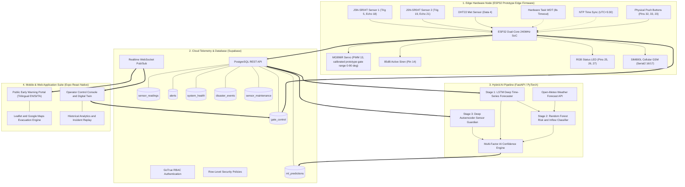
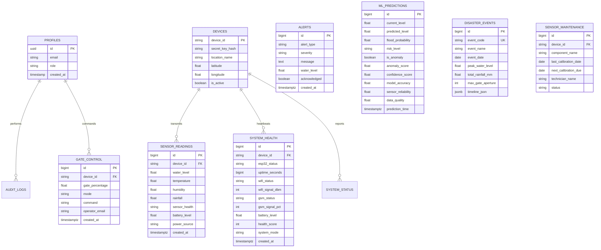
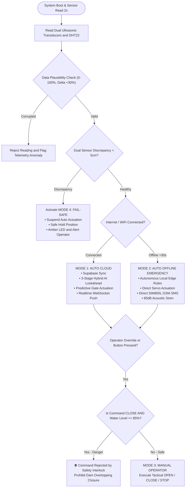

# 📐 SDAS — Complete Engineering Blueprints & Technical Schematics
## University Thesis Technical Specification Portfolio

> **Single Dam Simulation Environment:** Implemented a configurable simulated dam profile based on the Tabbowa Dam environment to demonstrate water-level monitoring, AI prediction, automated gate control, and emergency alert workflows.

---

## 1. Unified Cyber-Physical System Architecture



---

## 2. Hardware Circuit Pinout & Interconnect Specifications

| Component | ESP32 Pin | Interface Type | Operating Voltage | Function |
|---|---|---|---|---|
| **JSN-SR04T Sensor 1** | `GPIO 5` (Trig), `GPIO 18` (Echo) | Digital I/O | $5.0\text{V}$ (Logic Level 3.3V) | Primary Water Level Measurement |
| **JSN-SR04T Sensor 2** | `GPIO 19` (Trig), `GPIO 21` (Echo)| Digital I/O | $5.0\text{V}$ (Logic Level 3.3V) | Secondary Redundant Cross-Check |
| **DHT22 Met Sensor**   | `GPIO 4` (Data) | 1-Wire Digital | $3.3\text{V}$ | Speed-of-Sound Calibration & Humidity |
| **MG996R Servo**       | `GPIO 13` (PWM) | 50Hz PWM ($500-2400\mu\text{s}$) | $5.0\text{V} - 6.8\text{V}$ ($2\text{A}$ Peak) | Spillway Gate Actuator (Calibrated Prototype Range $0-90^\circ$) |
| **SIM800L GSM Module** | `GPIO 16` (RX2), `GPIO 17` (TX2) | Hardware UART2 ($9600\text{ baud}$) | $3.7\text{V} - 4.2\text{V}$ ($2\text{A}$ Burst) | Autonomous Direct Cellular SMS |
| **RGB Status LED**     | `GPIO 25` (R), `GPIO 26` (G), `GPIO 27` (B) | Active-HIGH Digital | $3.3\text{V}$ | 4-Tier Optical Status Indicator |
| **Active 85dB Buzzer** | `GPIO 14` | Active-HIGH Digital | $5.0\text{V}$ | Emergency Evacuation Siren |
| **Physical Button OPEN**| `GPIO 32` | Internal Pull-Up | $3.3\text{V}$ | Manual Override: 50% Emergency Release |
| **Physical Button CLOSE**|`GPIO 33` | Internal Pull-Up | $3.3\text{V}$ | Manual Override: Close (Interlocked) |
| **Physical Button STOP**| `GPIO 23` | Internal Pull-Up | $3.3\text{V}$ | Manual Override: Instant Hold / Reset |
| **Battery Voltage ADC**| `GPIO 34` (ADC1_CH6) | Analog Input ($100\text{k}\Omega / 27\text{k}\Omega$) | $0-3.3\text{V}$ | 12V Mains & 18650 UPS Monitoring |

---

## 3. Database Entity-Relationship (ER) Diagram



---

## 4. 4-Tier Operating Decision Flowchart



---

## 5. Safe Operational Control & Calibration Matrix

| Alert | Water Level | Storage | Gate | LED | Action |
|---|---|---|---|---|---|
| 🟢 NORMAL | <70% | >30% | Closed 0° | Green | Store water, normal logging |
| 🟡 PRE-WARNING | 70–85% | 15–30% | Closed 0° | Yellow | Preserve storage, operator monitoring |
| 🟠 WARNING | 70–85% + rapid surge | 15–30% | 20% Open (36°) | Orange | Controlled buffer release + warning alert |
| 🔴 DANGER | >85% or predicted overflow risk | <15% | 50% Open (90°) | Red | Emergency controlled release + SMS + siren |

### Physical Tank Ruler Distance Calibration (Centimeters)
```cpp
// 3-Point Calibration distance constants in SDAS_ESP32_Code.ino:
float CALIB_EMPTY_DIST_CM  = 100.0f; // Distance when reservoir is EMPTY (0% water level) -> Max distance
float CALIB_HALF_DIST_CM   = 55.0f;  // Distance when reservoir is HALF FULL (50% water level)
float CALIB_FULL_DIST_CM   = 10.0f;  // Distance when reservoir is FULL (100% water level) -> Min distance

// Water Level % = ((CALIB_EMPTY_DIST_CM - Current Distance) / (CALIB_EMPTY_DIST_CM - CALIB_FULL_DIST_CM)) * 100.0%
```

---

## 6. Mobile Client Simulation Architecture

> The React Native Expo application provides a configurable simulated dam environment where operators can monitor reservoir conditions, water levels, alerts, and control actions through a single prototype dam model.

* **Digital Twin Console:** Real-time synchronized bi-directional link to Supabase PostgreSQL and ESP32 Edge hardware.
* **Role-Based Views:** Public Civilian Portal (Unrestricted, trilingual) + Operator Tactical Console (Authenticated via Supabase Auth).
* **Multi-Parameter Verification:** Combines real-time transducer feeds, speed-of-sound adjustments, Open-Meteo weather forecast API, and 3-stage ML inference metrics.
